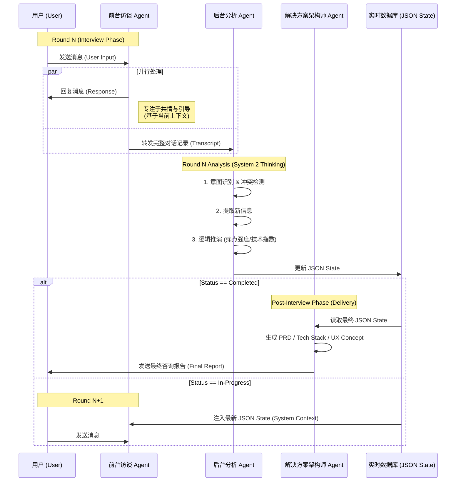

# Triple-Agent Collaboration Architecture: AI Product Opportunity Researcher

## 1. 架构概述 (Architecture Overview)

为解决“高情商访谈”、“高精度结构化分析”与“高价值方案交付”之间的矛盾，本系统采用 **Triple-Agent (三智体)** 协同架构。

*   **Frontend Agent (访谈者):**
    *   **角色:** 社会研究员 (Social Researcher)
    *   **职责:** 负责自然语言交互、共情、引导话题、维持对话节奏。它**不直接**负责维护完整的 JSON 状态，而是专注于对话本身。
*   **Backend Agent (分析师):**
    *   **角色:** 数据分析师 (Data Analyst)
    *   **职责:** 作为“隐形观察者”，在后台监听每一轮对话。负责从非结构化对话中提取结构化数据，执行逻辑推演 (System 2 Thinking)，并更新 JSON 数据库。
*   **Architect Agent (架构师) [NEW]:**
    *   **角色:** 解决方案架构师 (Solution Architect)
    *   **职责:** 在访谈结束后触发。读取最终的 JSON State，生成专业的 PRD、技术架构图和 UX 设计建议。

---

## 2. 协同工作流 (Collaboration Workflow)

采用 **"Async Observer Loop with Context Injection" (异步观察者循环+上下文注入)** 模式，并在最后增加 **"Deliverable Generation" (交付物生成)** 阶段。

### 流程图解



---

## 3. 数据流传输机制 (Data Flow & Protocol)

### A. 前台 -> 后台 (Input Stream)
后台 Agent 接收的输入包含两部分：
1.  **Full Conversation History (Transcript):** 完整的对话记录，用于上下文理解。
2.  **Current JSON State (Optional):** 上一轮的 JSON 状态（增量更新模式下需要）。

### B. 后台 -> 数据库 (State Update)
后台 Agent 输出标准的 JSON 对象。系统层（Orchestrator）负责将其写入数据库。

### C. 数据库 -> 前台 (Context Injection)
在下一轮对话开始前，系统将最新的 JSON 数据摘要注入到前台 Agent 的 System Prompt 或 Context Window 中。

**注入提示词示例 (Injected into Frontend):**
```markdown
[System Notice]
当前访谈数据状态 (由后台分析师实时更新):
- 已知信息: 职业(独立开发者), 痛点(AWS账单管理混乱), 意图(Idea-driven)
- 缺失/待确认信息: 具体技术栈偏好, 预期产品形态
- 下一步建议: 请重点询问用户目前是如何手动处理账单的，以评估痛点强度。
```

---

## 4. 关键机制设计

### 1. 隐形结构化 (Invisible Structuring)
前台 Agent 不需要显式地去“填表”。它只需要像人一样聊天。后台 Agent 负责把聊天内容“翻译”成表格。

### 2. 幻觉校验 (Hallucination Check)
后台 Agent 使用推理模型 (Reasoning Model)，具备更强的逻辑一致性检测能力。
*   如果用户前后说法不一（例如：开头说不懂技术，后来又提到了 React），后台 Agent 会在 JSON 中标记 `conflict_flag`。
*   下一轮注入时，系统会提示前台 Agent：“检测到信息冲突，请委婉确认用户技术背景。”

### 3. 延迟容忍 (Latency Tolerance)
*   **前台响应**必须是实时的 (Low Latency)。
*   **后台分析**可以是异步的 (High Latency)。即使后台分析慢了一拍，前台 Agent 依然可以基于“上一轮”的状态继续对话，不会造成卡顿。

---

## 5. 部署建议

*   **Cost Optimization:** 后台 Agent 不需要每一轮都运行。可以配置为：
    *   **每 3-5 轮** 运行一次全量分析。
    *   或者当检测到**关键意图切换**时触发。
*   **Model Selection:**
    *   Frontend: `claude-3-5-sonnet-20241022` or `deepseek-chat`
    *   Backend: `o3-mini` or `deepseek-reasoner`
